<div align="center">
  
  <br />
  <br />

[](https://nextjs.org/)
[](https://www.typescriptlang.org/)
[](https://tailwindcss.com/)
[](https://lucide.dev/)
[](https://api.wynncraft.com/)
[](https://opensource.org/licenses/MIT)

  <p align="center">
    <b>
      Wynncraft Explorer is a comprehensive, modern, and fast data research and analysis platform developed for the popular Minecraft MMORPG Wynncraft. Built with Next.js, React, and modern web technologies, it offers a rich and modern user interface that provides detailed statistics for players, characters, guilds, classes, and leaderboards.
    </b>
    <br />
    <br />
    <a href="#technologies">Technologies</a> •
    <a href="#modules">Modules</a> •
    <a href="#installation">Installation</a> •
    <a href="#license">License</a>
  </p>
</div>

---

## 📋 About

This project allows players to examine their in-game progress, classes, ability trees, and guild activities in a detailed and aesthetic way by fetching data through the official Wynncraft API.
High performance and reliability are aimed for with its strong TypeScript-based architecture and Next.js's App Router system.

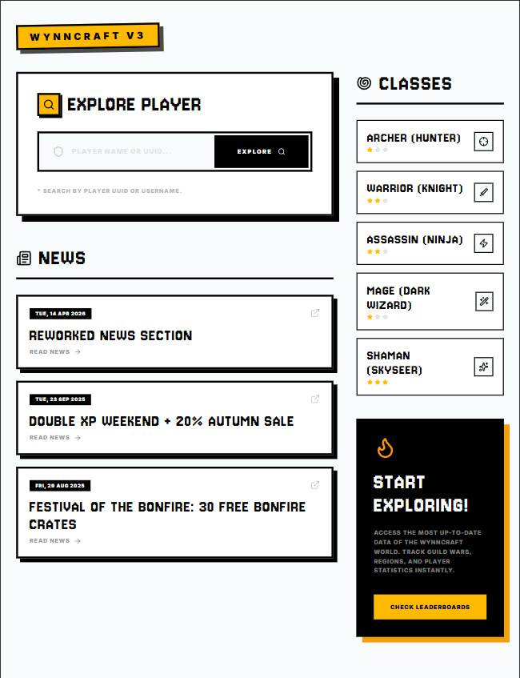

## 🛠️ Technologies <a id="technologies"></a>

- **Framework:** Next.js 16+
- **Library:** React 19
- **Style & Design:** TailwindCSS v4
- **Icons:** Lucide React
- **Language:** TypeScript
- **Data Provider:** Wynncraft API v3

## 📦 Modules <a id="modules"></a>

### 👤 Player Module (`app/player/`)

This is the most fundamental module of the project, showing player statistics, progress, and equipment.

- **`player/[uuid]`**: Contains a specific player's general statistics; join date, rank, guild information, total playtime, and score/status data.
- **`player/[uuid]/characters`**: Lists the characters owned by the player (Mage, Archer, Warrior, etc.) with summary data on a single page.
- **`player/[uuid]/characters/[characterUuid]`**: Covers in-depth and micro-level analysis of a specific character. Lists core combat levels, professions (gathering/crafting levels like Mining, Woodcutting, Crafting), completed dungeon and quest statistics, as well as skill point distributions if available.

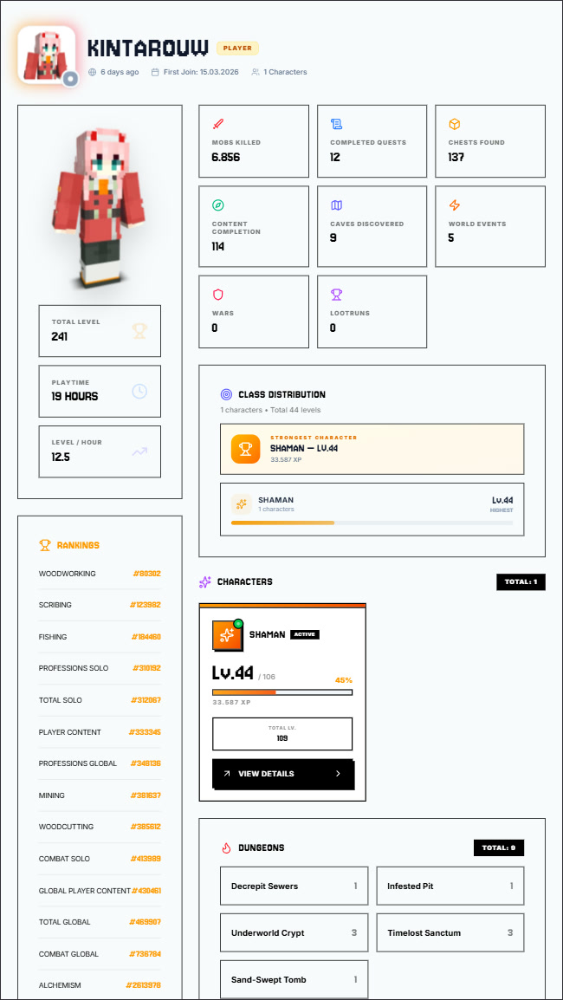 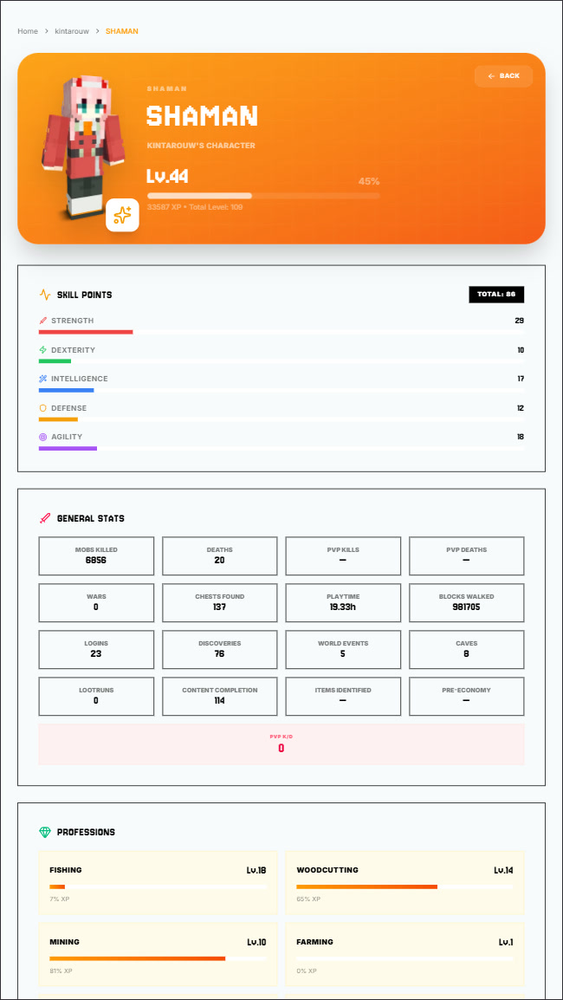

### 🛡️ Guild Module (`app/guilds/`)

High-interaction guild research sections that bring the massive guild system on the server to the screens.

- **`guilds/`**: Main guild portal. Lists popular or searched guilds registered in the system (uses the `GuildListClient` interface).
- **`guilds/[name]`**: Full statistics of a specific guild. Includes the guild member list (`GuildMemberListClient`), ranks of these members _(Owner, Chief, Strategist, Captain, Recruiter, Recruit)_, guild level, XP amounts, and general progression metrics.
- **`guilds/territories/`**: Area used to examine or list the territories captured by guilds.
- **`guilds/prefix/`**: Sub-route or dynamic route that allows quickly finding a guild by its prefix (e.g., "ANO") rather than its full name.

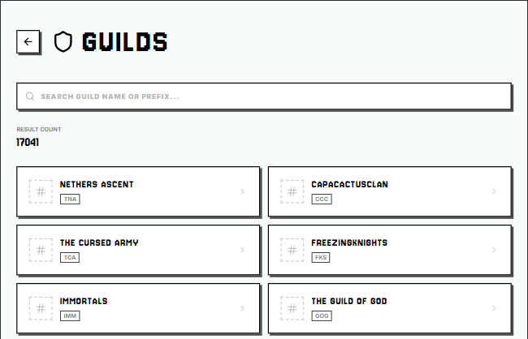

##

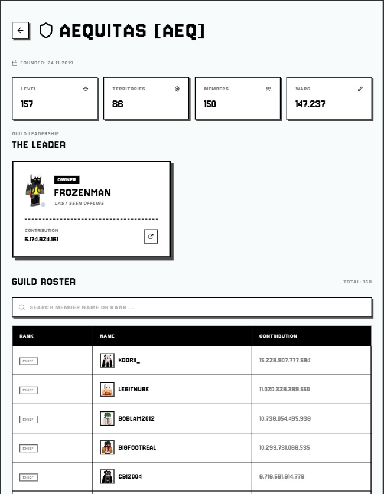
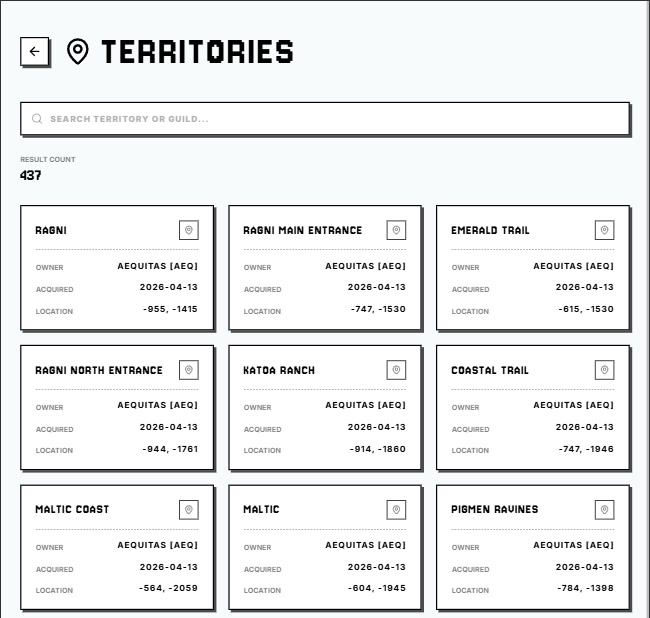

### ⚔️ Class and Ability System (`app/classes/`)

Examines Wynncraft's complex character class templates.

- **`classes/`**: Core information structure listing the main classes available in the game and their handling mechanisms.
- **`classes/[className]`**: Offers detailed views specific to the selected class (Archer/Hunter, Warrior/Knight, etc.). Template information containing basic abilities and progressions belonging to the classes is displayed.

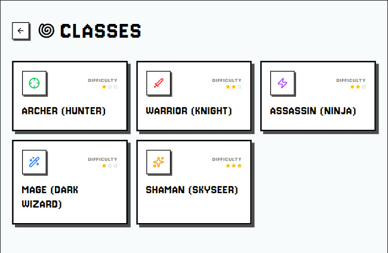

##

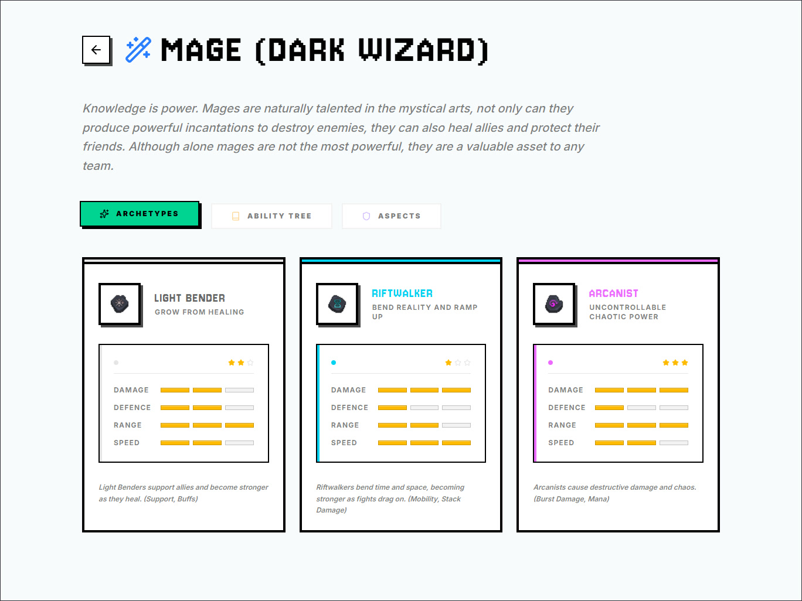

### 🏆 Leaderboards (`app/leaderboards/`)

- **`leaderboards/`**: List of all leaderboards in the game
- **`leaderboards/[type]`**: Reflects the overall competitive status of players and guilds in different categories. Global record rankings based on "PvP", "Combat", or "Guild" are brought through sub-routes.

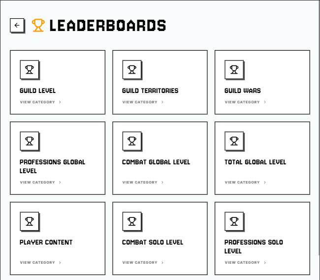
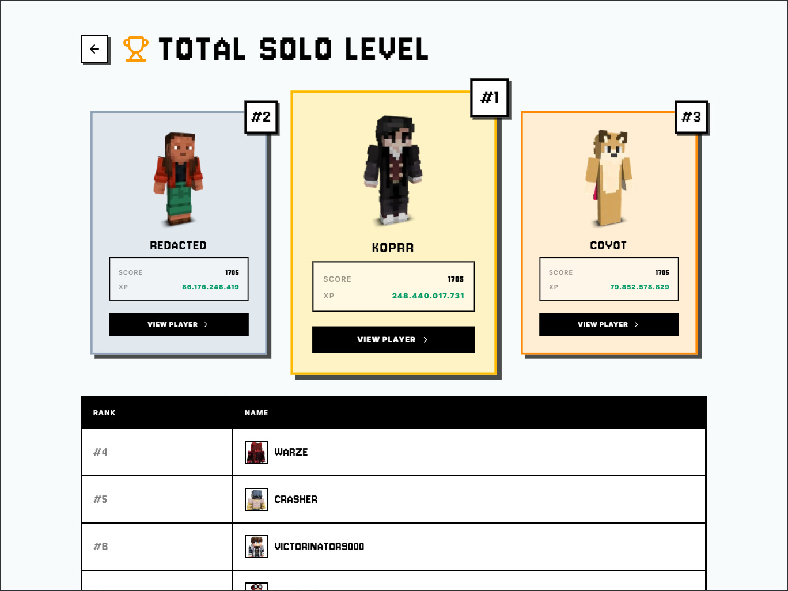

### 📰 News (`app/news/`)

- Lists and allows reading of general server announcements and update notes published by the Wynncraft management.

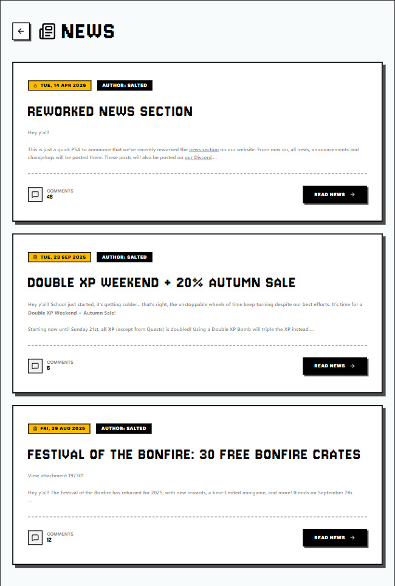

## 🔌 API / Service Integrations (`api/` Folder)

Our business intelligence / service layer that feeds data to the user interface in a secure and modular structure. Requests are processed at this point and served to Client or Server Components:

- **`wynnClient.ts`**: The core fetch (connection) utility where all API data is pulled and endpoint paths are configured.
- **`playerService.ts`**: Function layer managing player profiles and UUID search functions.
- **`guildService.ts`**: Special request manager pulling guild-related data (member details, XP, territories).
- **`classService.ts` & `abilityService.ts`**: Service structures modeling in-game class abilities.
- **`leaderboardsService.ts` & `newsService.ts`**: API connectors executing leaderboard and news requests.

## ⚙️ Setup and Installation <a id="installation"></a>

Setting up the project on your local computer is quite simple. Follow the steps below:

1. **Clone the Project**

   ```bash
   git clone https://github.com/xkintaro/wynncraft-explorer.git
   cd wynncraft-explorer
   ```

2. **Download Required Packages**
   Download the modules required for the application to run with Node Package Manager:

   ```bash
   npm install
   ```

3. **Start the Development Environment**
   ```bash
   npm run dev
   ```
   The application will be compiled in the background and will be available at **`http://localhost:3000`** by default.

## 📝 Legal Notice and License <a id="license"></a>

This project is being developed as open source for the benefit of the community. Wynncraft game data, naming rights, and in-game materials belong entirely to **Wynncraft LLC**. This webpage is not an official Wynncraft product.

---

<p align="center">
  <sub>❤️ Developed by Kintaro.</sub>
</p
