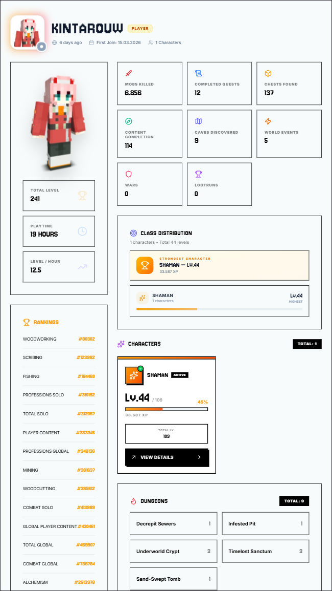
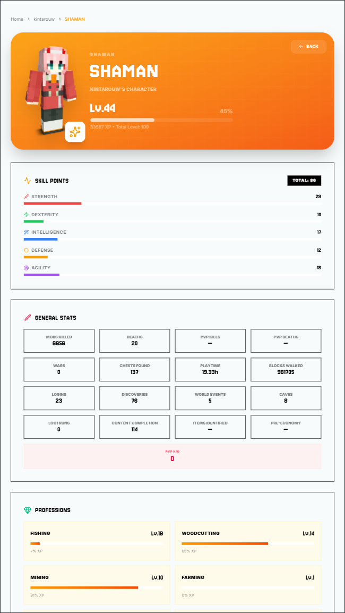
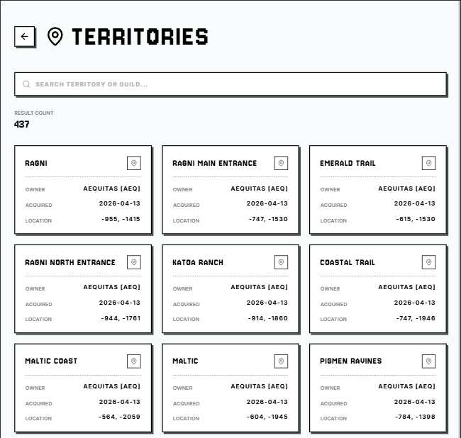
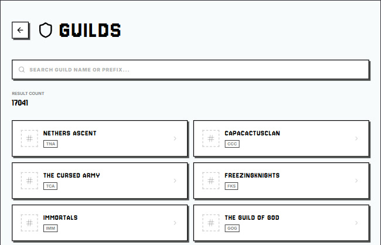
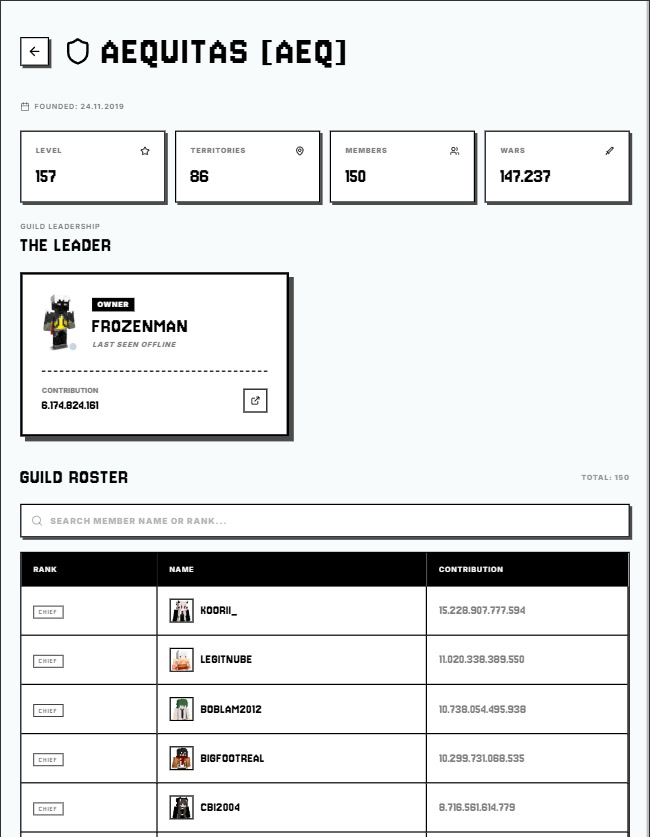
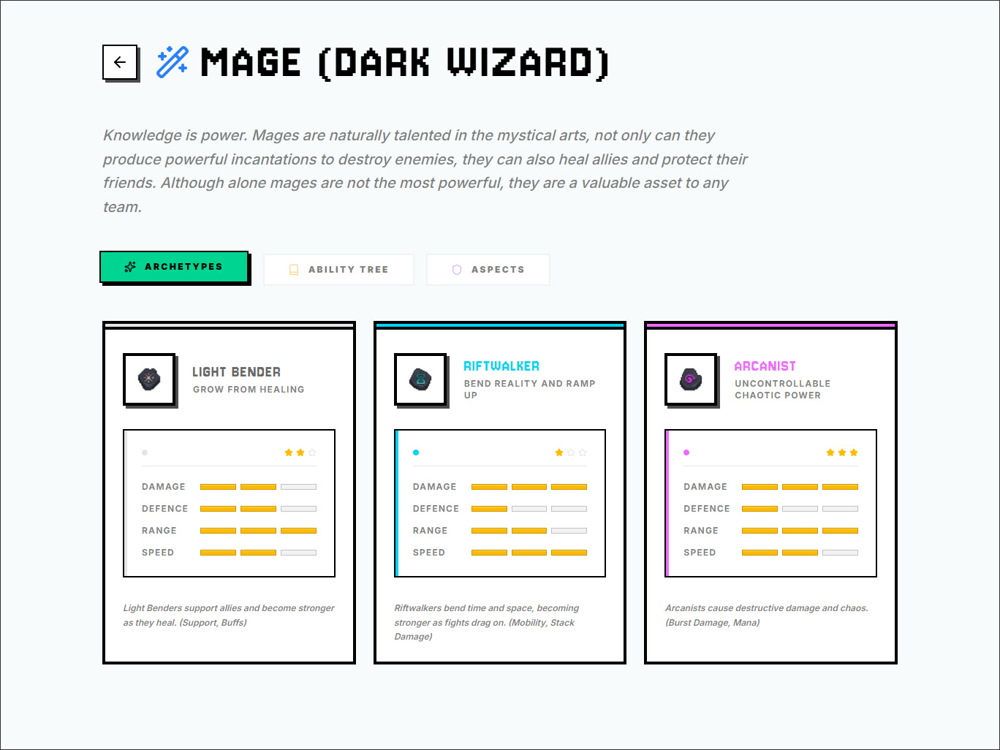
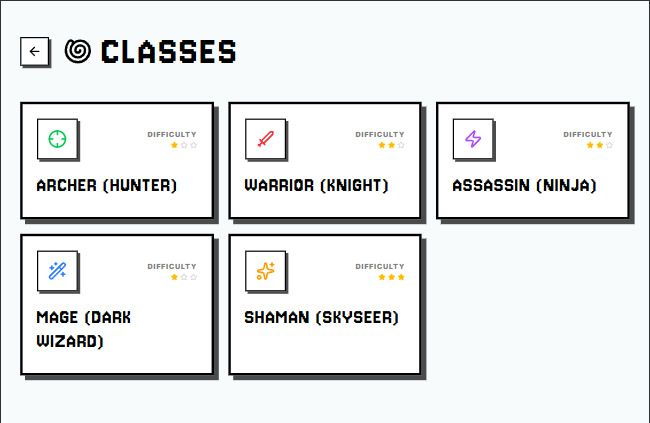
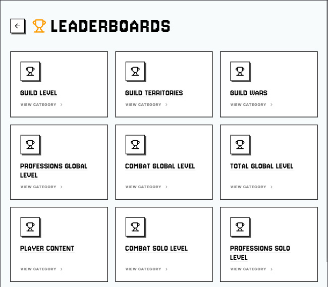
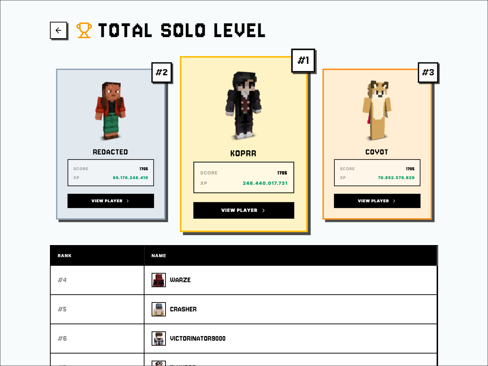
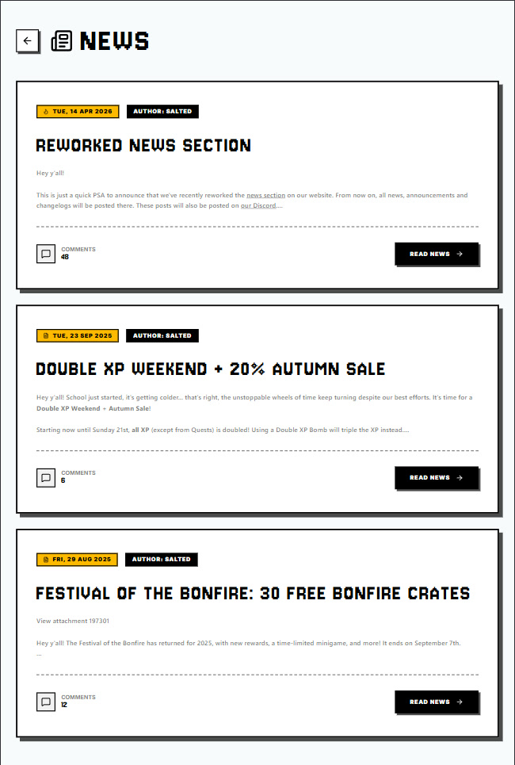

<a href="README.md">
 
</a>
<a href="README-TR.md">
 
</a>

  <br />
  <br />

<div align="center">
  
  <br />
  <br />

  <p>
    Wynncraft statistics, guild, and player analysis platform.
  </p>


  <p>    
    <a href="#modules">Modules</a> •
    <a href="#technologies">Technologies</a> •
    <a href="#installation">Installation</a> •
    <a href="#license">License</a>
  </p>

  <br />
  <br />
</div>

## 📷 Demo Link

- [https://wynncraft-explorer.vercel.app/](https://wynncraft-explorer.vercel.app/)

## 📋 About

**Wynncraft Explorer** is a modern and fast data analysis platform developed for the popular Minecraft MMORPG Wynncraft. Built with Next.js, React, TypeScript, and modern web technologies, it provides a rich and aesthetic interface for exploring detailed statistics about players, characters, guilds, classes, ability trees, and leaderboards through the official Wynncraft API. The project focuses on performance, reliability, and a smooth user experience using a strong TypeScript-based architecture and Next.js App Router.

## 📦 Modules <a id="modules"></a>

### 👤 Player Module (`app/player/`)

This is the most fundamental module of the project, showing player statistics, progress, and equipment.

- **`player/[uuid]`**: Contains a specific player's general statistics; join date, rank, guild information, total playtime, and score/status data.
- **`player/[uuid]/characters`**: Lists the characters owned by the player (Mage, Archer, Warrior, etc.) with summary data on a single page.
- **`player/[uuid]/characters/[characterUuid]`**: Covers in-depth and micro-level analysis of a specific character. Lists core combat levels, professions (gathering/crafting levels like Mining, Woodcutting, Crafting), completed dungeon and quest statistics, as well as skill point distributions if available.

<details>
  <summary>📸 Screenshots</summary>
  <br />
   
</details>

### 🛡️ Guild Module (`app/guilds/`)

High-interaction guild research sections that bring the massive guild system on the server to the screens.

- **`guilds/`**: Main guild portal. Lists popular or searched guilds registered in the system (uses the `GuildListClient` interface).
- **`guilds/[name]`**: Full statistics of a specific guild. Includes the guild member list (`GuildMemberListClient`), ranks of these members _(Owner, Chief, Strategist, Captain, Recruiter, Recruit)_, guild level, XP amounts, and general progression metrics.
- **`guilds/territories/`**: Area used to examine or list the territories captured by guilds.
- **`guilds/prefix/`**: Sub-route or dynamic route that allows quickly finding a guild by its prefix (e.g., "ANO") rather than its full name.

<details>
  <summary>📸 Screenshots</summary>
  <br />
   
  <br />
  <br />
  
</details>

### ⚔️ Class and Ability System (`app/classes/`)

Examines Wynncraft's complex character class templates.

- **`classes/`**: Core information structure listing the main classes available in the game and their handling mechanisms.
- **`classes/[className]`**: Offers detailed views specific to the selected class (Archer/Hunter, Warrior/Knight, etc.). Template information containing basic abilities and progressions belonging to the classes is displayed.

<details>
  <summary>📸 Screenshots</summary>
  <br />
   
</details>

### 🏆 Leaderboards (`app/leaderboards/`)

- **`leaderboards/`**: List of all leaderboards in the game
- **`leaderboards/[type]`**: Reflects the overall competitive status of players and guilds in different categories. Global record rankings based on "PvP", "Combat", or "Guild" are brought through sub-routes.

<details>
  <summary>📸 Screenshots</summary>
  <br />
   
</details>

### 📰 News (`app/news/`)

- Lists and allows reading of general server announcements and update notes published by the Wynncraft management.

<details>
  <summary>📸 Screenshots</summary>
  <br />
  
</details>

## 🛠️ Technologies <a id="technologies"></a>

- **Next.js**: Modern React framework utilizing App Router and Server Components for optimal performance.
- **React 19**: The core user interface library featuring concurrent rendering and server actions.
- **Tailwind CSS**: Utility-first CSS framework for rapid and modern responsive styling.
- **Lucide Icons**: Beautiful and consistent SVG icon library for modern web interfaces.
- **TypeScript**: Strongly typed programming language building on top of JavaScript for robust development.
- **Wynncraft API v3**: The official public service used to fetch real-time game data, players, and guilds.

## 🚀 <a id="installation"></a> Installation

You can follow the steps below to run the project in your local environment.

1. **Clone the Repository**

   ```bash
   git clone https://github.com/xkintaro/wynncraft-explorer.git
   cd wynncraft-explorer
   ```

2. **Install Dependencies**

   ```bash
   npm install
   ```

3. **Start the Development Server**

   ```bash
   npm run dev
   ```

   The application will be compiled in the background and will be available at **`http://localhost:3000`** by default.

## 🔌 API / Service Integrations (`api/` Folder)

Our business intelligence / service layer that feeds data to the user interface in a secure and modular structure. Requests are processed at this point and served to Client or Server Components:

- **`wynnClient.ts`**: The core fetch (connection) utility where all API data is pulled and endpoint paths are configured.
- **`playerService.ts`**: Function layer managing player profiles and UUID search functions.
- **`guildService.ts`**: Special request manager pulling guild-related data (member details, XP, territories).
- **`classService.ts` & `abilityService.ts`**: Service structures modeling in-game class abilities.
- **`leaderboardsService.ts` & `newsService.ts`**: API connectors executing leaderboard and news requests.

## 📄 Legal Notice and License <a id="license"></a>

This project is licensed under the [MIT License](LICENSE). It is being developed as open source for the benefit of the community. Wynncraft game data, naming rights, and in-game materials belong entirely to **Wynncraft LLC**. This webpage is not an official Wynncraft product.

#

<p align="center">
  <sub>❤️ Developed by "Mustafa TAŞAL" (kintaro)</sub>
</p>